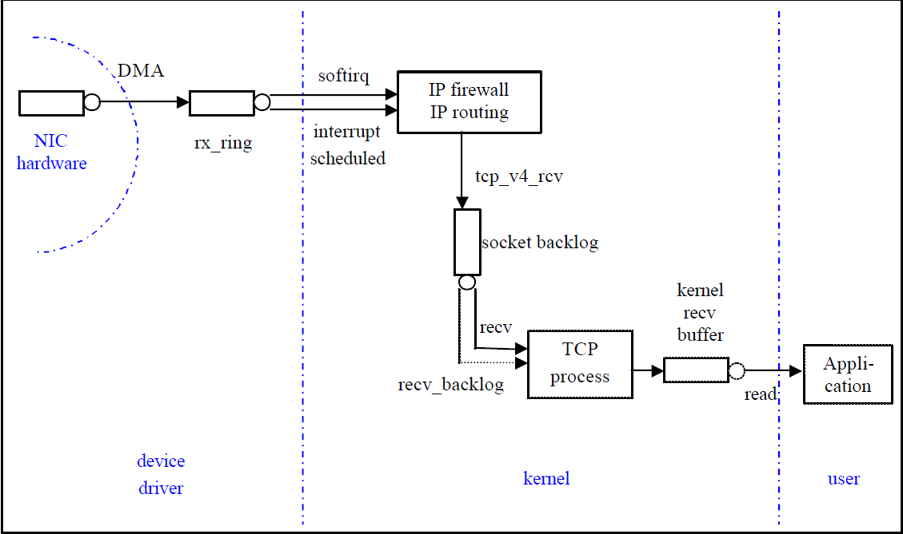
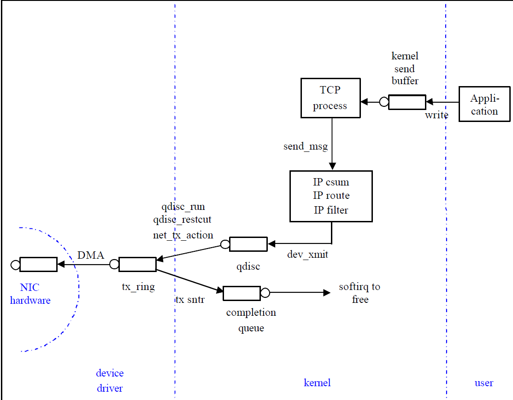

## 1 MTU in switch  
[MTU in L2 and L3(IP)] (https://ccieblog.co.uk/uncategorized/mtu-values-and-ping-on-cisco-products)

## 2 SOCK_RAW
```python
sockfd = socket.socket(socket.AF_INET, socket.SOCK_RAW, socket.IPPROTO_ICMP)--ip packet---AF_INET

sockfd = socket.socket(socket.AF_PACKET, socket.SOCK_RAW, socket.ntohs(3))--ethernet packet
#define ETH_P_ALL       0x0003          /* Every packet (be careful!!!) */
#define ETH_P_IP        0x0800          /* Internet Protocol packet     */
```
## 3 comm
```
FullMsg, MsgPayload---pack/unpack
Msghandler emit/recv via conn. Connection via dedicated one type connector e.g tcp channel.
TaskSchedule
```

## 4 socket / file descripter
```
socket associated local IP@ and port
file descripter associated 5 elements : source IP@/source port/des IP@/dest port/protocol
```
## 5 data transfer
```
PC_A-->dest IP@-->PC_B:
==
PC_A->dest IP@--->ARP--->switch--->Router: return mac@ of router, then data transfer to Router;
check the dest IP@, Router--->switch....->PC_B.
==
==
Action: if no dest mac@ in ARP table, ARP broadcast.
          if target PC_B responsed, then get mac@, construct ip layer/ethernet layer to send.
          if router(default gw) find dest mac@ is in another network, response with route mac@, 
                            then get mac@, contruct ip/ethernet layer to send to router.
             router will continue check go to Action.
```
## broadcast vs flooding
```
ARP by sending a request as broadcast to the another VLAN network will not be reached.
Flooding is also not allowed for different vlans port.
A switch never broadcasts frames, host usually do broadcast.
  ARP is example for barodcast for finding IP@'s mac
A switch can only flood a frame.
 Flooding is for that unknown destination mac comes into switch:
  Since it doesn't know where the destination MAC address is, it floods the frame out all ports.
   simply duplicate the frame and send it out all other ports.

Flooding :-
Flooding is performed when the switch has no entry for the frame's destination MAC address. When a frame is flooded, it is sent out every single port on the swtich except the one it came in one. Unknown unicast frames are always flooded. 

Forwarding :-
Forwarding is performed when the switch does have an entry for the frame's destination MAC address. Forwarding a frame means the frame is being sent out only one port on the switch. 

Filtering :-  Switch then fiters the frame (i.e. it kills the frame). Switch never sends a frame back to the same port it came in from.
Filtering is performed when the switch has an entry for both the source and destination MAC address, and the MAC table indiacates that both addresses are found off the same port.

Broadcasting :- There is one other frame type that is sent out every port on the switch except the one that received it, and that's a broadcast frmae, Broadcast frames are intended for all hosts, and the MAC broadcast address is ff-ff-ff-ff-ff-ff ( or FF-FF-FF-FF-FF-FF, as a MAC address's case does not matter. )
```
## packet flow
[kernel flow](https://wiki.linuxfoundation.org/networking/kernel_flow)  
[netwrok arch](https://cse.yeditepe.edu.tr/~kserdaroglu/spring2014/cse331/termproject/BOOKS/ProfessionalLinuxKernelArchitecture-WolfgangMauerer.pdf)  
[net map](https://www.cs.dartmouth.edu/~sergey/me/netreads/path-of-packet/tr-datatag-2004-1.pdf)  
[recv](https://people.redhat.com/pladd/MHVLUG_2017-04_Network_Receive_Stack.pdf)
```
struct sock {
wait_queue_head_t *sk_sleep;
struct sk_buff_head sk_receive_queue;
/* Callback */
void (*sk_data_ready)(struct sock *sk, int bytes);
}
Passing the incoming packet to an upper layer is done in tcp_rcv_established() and tcp_data_queue(). 
These functions maintain the tcp connection's out_of_order_queue, and the socket's sk_receive_queue and sk_async_wait_queue. 
If a user process is already waiting for data to arrive, 
the data is immediately copied to user space using skb_copy_datagram_iovec(). 
Otherwise, the sk_buff is appended to one of the socket's queues and will be copied later.
Finally, the receive functions call the socket's sk_data_ready virtual method to signal that data is available. 
This wakes up waiting processes.
```


## interrupt top half and bottom halt
[recv](https://blog.packagecloud.io/eng/2016/10/11/monitoring-tuning-linux-networking-stack-receiving-data-illustrated/)
 

```
The high level path a packet takes from arrival to socket receive buffer is as follows:

Driver is loaded and initialized.
Packet arrives at the NIC from the network.
Packet is copied (via DMA) to a ring buffer in kernel memory.
Hardware interrupt is generated to let the system know a packet is in memory.
Driver calls into NAPI to start a poll loop if one was not running already.
ksoftirqd processes run on each CPU on the system. They are registered at boot time. The  ksoftirqd processes pull packets off the ring buffer by calling the NAPI poll function that the device driver registered during initialization.
Memory regions in the ring buffer that have had network data written to them are unmapped.
Data that was DMA’d into memory is passed up the networking layer as an ‘skb’ for more processing.
Incoming network data frames are distributed among multiple CPUs if packet steering is enabled or if the NIC has multiple receive queues.
Network data frames are handed to the protocol layers from the queues.
Protocol layers process data.
Data is added to receive buffers attached to sockets by protocol layers.
```
## websocket
```
websocket based on http, make sure that date send and receive as the same block, not bytes streaming.
It is controlled in http like layer!
For application, it could rely on this to send json format data(dict)
websocket client>-----json-----<-----websocket server
```
## TCP Segment
'''
with GSO/TSO: delay to do the segmentation, send big packet to nic, let nic do the seg.
w/o  GSO/TSO: tcp_sendMsg to send MSS size data packet.
'''
