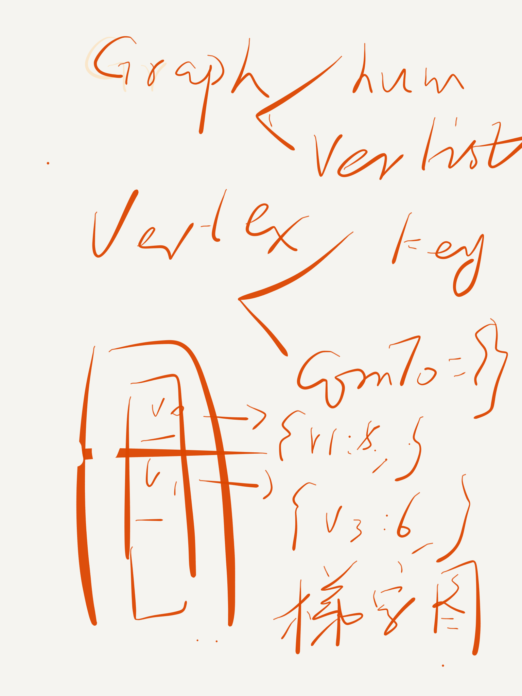

## Graph

```   
class Graph:
  class Vertex:
      def __init__(self, key):
          self.id = key
          self.connect_to = {}
          #{2:88, 3:99}
  def __init__(self):
      self.num_vertex = 0
      self.verlist = {}
      #{key1: {2:88, 3:99}}
      #{key2: {2:89, 4:77}}
```
      


