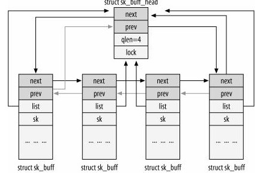
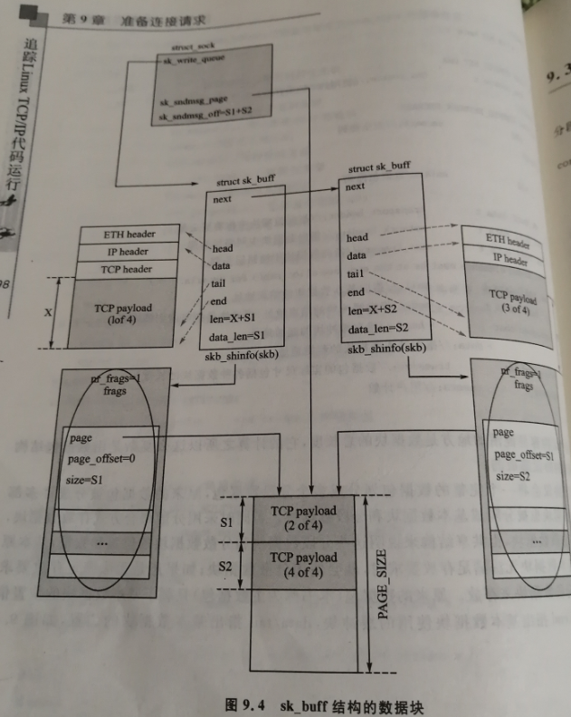
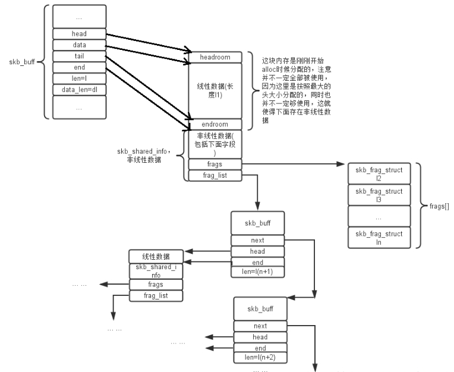

### struct sk_buff





```
/** 
 *	struct sk_buff - socket buffer
 *	@next: Next buffer in list
 *	@prev: Previous buffer in list
 *	@tstamp: Time we arrived/left
 *	@rbnode: RB tree node, alternative to next/prev for netem/tcp
 *	@sk: Socket we are owned by
 *	@dev: Device we arrived on/are leaving by
 *	@cb: Control buffer. Free for use by every layer. Put private vars here
 *	@_skb_refdst: destination entry (with norefcount bit)
 *	@sp: the security path, used for xfrm
 *	@len: Length of actual data
 *	@data_len: Data length
 *	@mac_len: Length of link layer header
 *	@hdr_len: writable header length of cloned skb
 *	@csum: Checksum (must include start/offset pair)
 *	@csum_start: Offset from skb->head where checksumming should start
 *	@csum_offset: Offset from csum_start where checksum should be stored
 *	@priority: Packet queueing priority
 *	@ignore_df: allow local fragmentation
 *	@cloned: Head may be cloned (check refcnt to be sure)
 *	@ip_summed: Driver fed us an IP checksum
 *	@nohdr: Payload reference only, must not modify header
 *	@nfctinfo: Relationship of this skb to the connection
 *	@pkt_type: Packet class
 *	@fclone: skbuff clone status
 *	@ipvs_property: skbuff is owned by ipvs
 *	@peeked: this packet has been seen already, so stats have been
 *		done for it, don't do them again
 *	@nf_trace: netfilter packet trace flag
 *	@protocol: Packet protocol from driver
 *	@destructor: Destruct function
 *	@nfct: Associated connection, if any
 *	@nf_bridge: Saved data about a bridged frame - see br_netfilter.c
 *	@skb_iif: ifindex of device we arrived on
 *	@tc_index: Traffic control index
 *	@tc_verd: traffic control verdict
 *	@hash: the packet hash
 *	@queue_mapping: Queue mapping for multiqueue devices
 *	@xmit_more: More SKBs are pending for this queue
 *	@ndisc_nodetype: router type (from link layer)
 *	@ooo_okay: allow the mapping of a socket to a queue to be changed
 *	@l4_hash: indicate hash is a canonical 4-tuple hash over transport
 *		ports.
 *	@sw_hash: indicates hash was computed in software stack
 *	@wifi_acked_valid: wifi_acked was set
 *	@wifi_acked: whether frame was acked on wifi or not
 *	@no_fcs:  Request NIC to treat last 4 bytes as Ethernet FCS
  *	@napi_id: id of the NAPI struct this skb came from
 *	@secmark: security marking
 *	@offload_fwd_mark: fwding offload mark
 *	@mark: Generic packet mark
 *	@vlan_proto: vlan encapsulation protocol
 *	@vlan_tci: vlan tag control information
 *	@inner_protocol: Protocol (encapsulation)
 *	@inner_transport_header: Inner transport layer header (encapsulation)
 *	@inner_network_header: Network layer header (encapsulation)
 *	@inner_mac_header: Link layer header (encapsulation)
 *	@transport_header: Transport layer header
 *	@network_header: Network layer header
 *	@mac_header: Link layer header
 *	@tail: Tail pointer
 *	@end: End pointer
 *	@head: Head of buffer
 *	@data: Data head pointer
 *	@truesize: Buffer size
 *	@users: User count - see {datagram,tcp}.c
 */

struct sk_buff {
	union {
		struct {
			/* These two members must be first. */
			struct sk_buff		*next;
			struct sk_buff		*prev;

			union {
				ktime_t		tstamp;
				struct skb_mstamp skb_mstamp;
			};
		};
		struct rb_node	rbnode; /* used in netem & tcp stack */
	};
	struct sock		*sk;
	struct net_device	*dev;

	/*
	 * This is the control buffer. It is free to use for every
	 * layer. Please put your private variables there. If you
	 * want to keep them across layers you have to do a skb_clone()
	 * first. This is owned by whoever has the skb queued ATM.
	 */
	char			cb[48] __aligned(8);

	unsigned long		_skb_refdst;
	void			(*destructor)(struct sk_buff *skb);
#ifdef CONFIG_XFRM
	struct	sec_path	*sp;
#endif
#if defined(CONFIG_NF_CONNTRACK) || defined(CONFIG_NF_CONNTRACK_MODULE)
	struct nf_conntrack	*nfct;
#endif
#if IS_ENABLED(CONFIG_BRIDGE_NETFILTER)
	struct nf_bridge_info	*nf_bridge;
#endif
	unsigned int		len,
				data_len;
	__u16			mac_len,
				hdr_len;

	/* Following fields are _not_ copied in __copy_skb_header()
	 * Note that queue_mapping is here mostly to fill a hole.
	 */
	kmemcheck_bitfield_begin(flags1);
	__u16			queue_mapping;
	__u8			cloned:1,
				nohdr:1,
				fclone:2,
				peeked:1,
				head_frag:1,
				xmit_more:1;
	/* one bit hole */
	kmemcheck_bitfield_end(flags1);

	/* fields enclosed in headers_start/headers_end are copied
	 * using a single memcpy() in __copy_skb_header()
	 */
	/* private: */
	__u32			headers_start[0];
	/* public: */

/* if you move pkt_type around you also must adapt those constants */
#ifdef __BIG_ENDIAN_BITFIELD
#define PKT_TYPE_MAX	(7 << 5)
#else
#define PKT_TYPE_MAX	7
#endif
#define PKT_TYPE_OFFSET()	offsetof(struct sk_buff, __pkt_type_offset)

	__u8			__pkt_type_offset[0];
	__u8			pkt_type:3;
	__u8			pfmemalloc:1;
	__u8			ignore_df:1;
	__u8			nfctinfo:3;

	__u8			nf_trace:1;
	__u8			ip_summed:2;
	__u8			ooo_okay:1;
	__u8			l4_hash:1;
	__u8			sw_hash:1;
	__u8			wifi_acked_valid:1;
	__u8			wifi_acked:1;

	__u8			no_fcs:1;
	/* Indicates the inner headers are valid in the skbuff. */
	__u8			encapsulation:1;
	__u8			encap_hdr_csum:1;
	__u8			csum_valid:1;
	__u8			csum_complete_sw:1;
	__u8			csum_level:2;
	__u8			csum_bad:1;

#ifdef CONFIG_IPV6_NDISC_NODETYPE
	__u8			ndisc_nodetype:2;
#endif
	__u8			ipvs_property:1;
	__u8			inner_protocol_type:1;
	__u8			remcsum_offload:1;
	/* 3 or 5 bit hole */

#ifdef CONFIG_NET_SCHED
	__u16			tc_index;	/* traffic control index */
#ifdef CONFIG_NET_CLS_ACT
	__u16			tc_verd;	/* traffic control verdict */
#endif
#endif

	union {
		__wsum		csum;
		struct {
			__u16	csum_start;
			__u16	csum_offset;
		};
	};
	__u32			priority;
	int			skb_iif;
	__u32			hash;
	__be16			vlan_proto;
	__u16			vlan_tci;
#if defined(CONFIG_NET_RX_BUSY_POLL) || defined(CONFIG_XPS)
	union {
		unsigned int	napi_id;
		unsigned int	sender_cpu;
	};
#endif
	union {
#ifdef CONFIG_NETWORK_SECMARK
		__u32		secmark;
#endif
#ifdef CONFIG_NET_SWITCHDEV
		__u32		offload_fwd_mark;
#endif
	};

	union {
		__u32		mark;
		__u32		reserved_tailroom;
	};

	union {
		__be16		inner_protocol;
		__u8		inner_ipproto;
	};

	__u16			inner_transport_header;
	__u16			inner_network_header;
	__u16			inner_mac_header;

	__be16			protocol;
	__u16			transport_header;
	__u16			network_header;
	__u16			mac_header;

	/* private: */
	__u32			headers_end[0];
	/* public: */

	/* These elements must be at the end, see alloc_skb() for details.  */
	sk_buff_data_t		tail;
	sk_buff_data_t		end;
	unsigned char		*head,
				*data;
	unsigned int		truesize;
	atomic_t		users;
};
```





### skb_shared_info 

Reference: https://stackoverflow.com/questions/10039744/difference-between-skbuff-frags-and-frag-list

```
#define skb_shinfo(SKB)	((struct skb_shared_info *)(skb_end_pointer(SKB)))

/* This data is invariant across clones and lives at
 * the end of the header data, ie. at skb->end.
 */
struct skb_shared_info {
	unsigned char	nr_frags;
	__u8		tx_flags;
	unsigned short	gso_size;
	/* Warning: this field is not always filled in (UFO)! */
	unsigned short	gso_segs;
	unsigned short  gso_type;
	struct sk_buff	*frag_list;
	struct skb_shared_hwtstamps hwtstamps;
	u32		tskey;
	__be32          ip6_frag_id;

	/*
	 * Warning : all fields before dataref are cleared in __alloc_skb()
	 */
	atomic_t	dataref;

	/* Intermediate layers must ensure that destructor_arg
	 * remains valid until skb destructor */
	void *		destructor_arg;

	/* must be last field, see pskb_expand_head() */
	skb_frag_t	frags[MAX_SKB_FRAGS];
};
```

#### nr_frags/frags[]----are for scatter-gather i/o buffers

**skb_shinfo(head)->frags[]**


When your device supports scatter-gather I/O, and you want it to do the combining of data etc.. you can populate `frags[]` structure starting with the 2nd fragment till nth fragment. The first fragment is always specified by the `data` and `tail` pointers. Rest of the fragments are filled in the `frags[]` structure. If you don't use scatter gather, this variable is empty.


If the NIC supports SG I/O [__ip_append_data](http://lxr.free-electrons.com/source/net/ipv4/ip_output.c#L833) will copy user space data to skb_shinfo(head)->frags. NIC driver (e.g. ixgbe_add_rx_frag) can also use these frags[] to carry the received network traffic; please note that every content in frags[] is a part of a complete packet. a complete packet consists of all frags[] + (skb->data ~ skb->tail).


#### frag_list----for IP fragments

**skb_shinfo(head)->frag_list**

This is the list of IP fragments. This will be filled during `ip_push_pending_frames`. Say your `sk_buffs` are in this arrangment

```
sk_buff0->next = sk_buff1
sk_buff1->next = sk_buff2
...
sk_buffn-1->next = sk_buffn
```

After `ip_push_pending_frames` is called

```
sk_buff0->frag_list = sk_buff1
sk_buff1->next = sk_buff2
...
sk_buffn-1->next = sk_buffn
```


This member is not used by IP fragmentation directly. In __ip_make_skb(), the frag_list is used to collect all skbs from sk->sk_write_queue; some NIC drivers also use this frag_list for carrying packet to upper network stack. Every content/skb in frag_list is also not a **complete** packet; tcp_v4_send_ack -> ip_send_unicast_reply -> ip_push_pending_frames -> ip_finish_skb ->__ip_make_skb;


